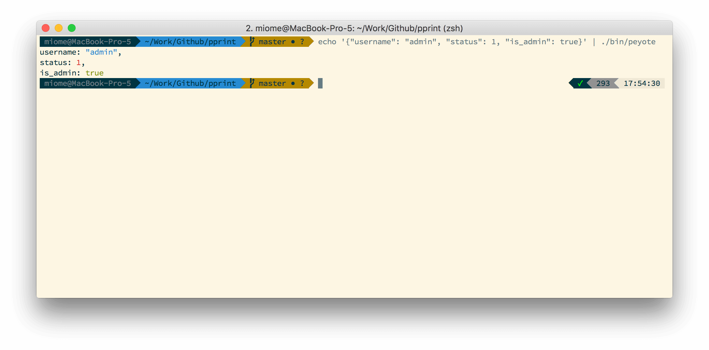

> Pretty printing all type of sources

# Install
```
$ npm install -g peyote
```

# About
Peyote is a simple and small flexible tool for pretty-print thing from cli!

# Usages

## Via pipe
```
$ echo '{"username": "admin", "status": 1, "is_admin_true"}' | peyote
``` 

## Via cli arguments
```
$ peyote '{"username": "admin", "status": 1, "is_admin_true"}'
```

# Output

